# 铁路信号数字孪生监测与可视化分析平台软件设计说明书

## 1 引言

### 1.1 编写目的

本文档用于对 铁路信号数字孪生监测与可视化分析平台 的建设背景、需求分析、总体架构、详细设计、接口设计、运行环境和运维方式进行整理说明，为软件著作权登记、技术归档和后续系统维护提供依据。

### 1.2 项目背景

本项目面向铁路信号监测与运维展示场景，围绕山区铁路区间信号设备的运行状态可视化需求进行开发。系统以数字孪生、地理信息可视化和大屏分析展示为主线，支持信号设备三维展示、环境监测、恶劣天气演练、告警联动和实时遥测接入。

### 1.3 术语定义

- 数字孪生：通过三维模型和实时或模拟数据对真实信号设备状态进行映射展示。
- 遥测：外部设备上报的距离、涉水等监测数据。
- 恶劣天气演练：通过全局模拟状态触发高湿、降雨、雾化等演示流程。
- GIS：地理信息系统，用于展示线路、站点及空间位置关系。

### 1.4 参考资料

- `docs/information.txt`
- `README.md`
- `AGENT.md`
- `src/`、`server/`、`package.json`、`vite.config.js`

## 2 需求分析

### 2.1 建设目标

- 建立铁路信号设备数字孪生展示能力。
- 建立铁路区间地理态势三维展示能力。
- 建立恶劣天气、湿度异常和人员靠近等演练能力。
- 建立前端综合可视化分析与告警联动展示能力。
- 建立基于 HTTP 和 WebSocket 的轻量化遥测接入能力。

### 2.2 业务需求

- 展示铁路区间地理环境、站点与线路分布。
- 展示核心信号设备的三维模型、参数和运行状态。
- 展示环境、调度、设备寿命、告警与运维统计信息。
- 接收外部设备的遥测数据并与界面联动。
- 在恶劣天气场景下展示湿度异常、告警弹窗和处置过程。

### 2.3 功能需求

- 主界面提供地理信息可视化、数字孪生面板和大数据可视化平台三类视图切换。
- Cesium 视图提供相机巡航、地图定位、信标波纹、天气演练、图表与 AI 助手演示。
- Three.js 视图提供信号机三维模型、列车动画、参数曲线、视频监控与遥测联动。
- 数据大屏提供环境监测、设备统计、告警列表、寿命预测和调度态势展示。
- 遥测桥接服务支持 JSON 数据上传、标准化处理和 WebSocket 广播。

### 2.4 非功能需求

- 界面应支持现代浏览器运行。
- 支持基于本地模拟数据的离线演示。
- 支持前端缓存，降低页面刷新后的数据空白。
- 页面切换和动画效果应具备较好的观感与连续性。

### 2.5 用户角色与权限需求

- 运维值守人员：查看设备运行状态和告警情况。
- 信号维护人员：关注信号机参数、异常分析和处置提示。
- 展示或调度人员：查看线路态势、运行统计和大屏结果。
- 当前版本未实现账号登录与角色鉴权，权限控制需求暂以业务角色描述体现。

## 3 系统概述

### 3.1 系统简介

系统采用单页应用模式运行，通过顶层 Tab 在三种核心视图之间切换。系统一方面使用本地模拟数据完成大部分可视化演示，另一方面通过 Node.js 遥测桥接服务接收外部设备上报数据，并通过 WebSocket 广播给前端，从而实现实时联动展示。

### 3.2 使用对象

- 铁路信号运维人员
- 信号设备维护人员
- 线路展示与调度分析人员
- 接入演示设备或传感器的测试人员

### 3.3 应用场景

- 铁路信号设备状态展示
- 区间线路地理态势展示
- 恶劣天气和湿度异常应急演练
- 行人靠近信号设备的安全预警演示
- 综合大屏演示和技术成果汇报

### 3.4 总体业务流程

1. 用户打开前端页面，系统默认进入数字孪生面板。
2. 前端读取本地模拟数据、建立全局状态和缓存数据。
3. 若开启遥测桥接服务，前端通过 WebSocket 建立连接并等待数据。
4. 外部设备通过 `POST /upload` 上报 JSON 数据。
5. 服务端规范化数据后广播给前端。
6. Three.js 面板根据遥测结果刷新距离、涉水和行人告警展示。
7. 用户可切换到 Cesium 视图或大数据视图查看综合信息。

### 3.5 系统用例图

<figure class="doc-figure diagram-figure">
  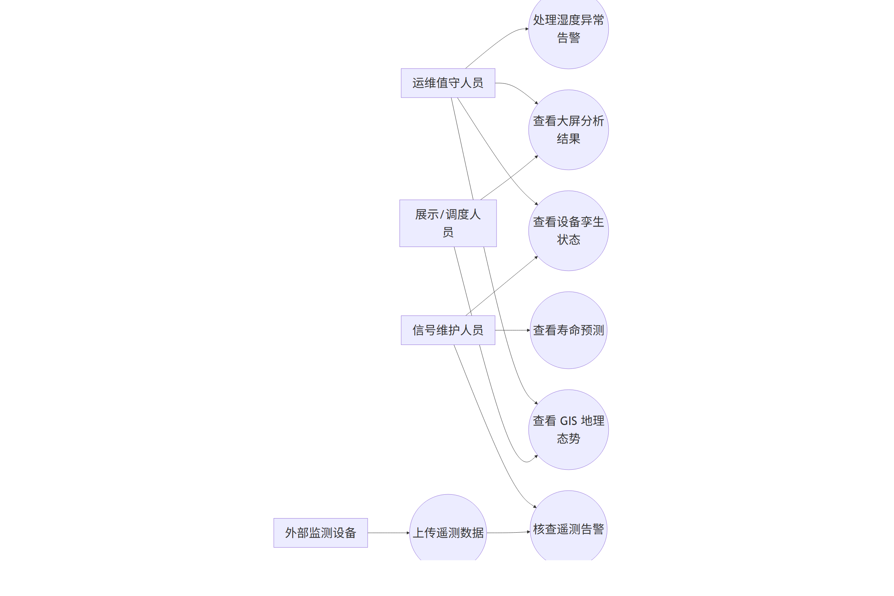
  <figcaption class="figure-caption">图 3-1 系统用例图</figcaption>
</figure>

该图从使用者视角描述系统的核心功能边界。图中包含运维值守人员、信号维护人员、展示或调度人员以及外部监测设备四类参与者，并将其与 GIS 地理态势查看、设备孪生状态查看、大屏分析查看、湿度异常告警处置、寿命预测核查和遥测数据上传等关键用例对应起来。通过该图可以直观看出系统并不是单纯的展示页面，而是同时覆盖可视化展示、状态监测、告警联动和设备接入四个层面的综合平台。该图适合放在系统概述章节，用于说明系统服务对象和主要业务能力的对应关系。

### 3.6 总体业务流程图

<figure class="doc-figure diagram-figure">
  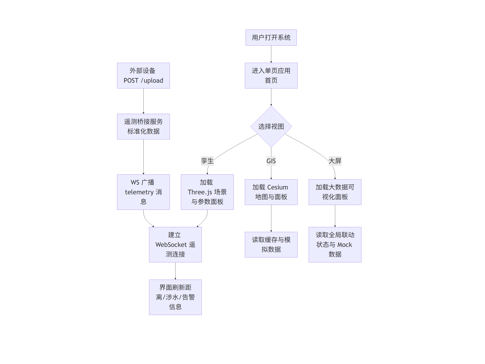
  <figcaption class="figure-caption">图 3-2 总体业务流程图</figcaption>
</figure>

该图描述系统从页面启动到数据联动完成的总体业务路径。用户首先打开单页应用首页，然后在地理信息可视化、数字孪生面板和大数据平台三个视图之间选择入口；与此同时，外部设备可通过上传接口进入遥测桥接服务，再由 WebSocket 将标准化遥测消息推送到前端。图中明确区分了用户操作链路和设备数据链路，其中 GIS 页面依赖缓存与模拟数据，大数据平台依赖全局联动状态和 Mock 数据，而 Three.js 孪生面板还承担实时遥测联动展示。该图用于说明系统主流程和数据流向，是需求分析与系统概述章节的重要补充。

## 4 总体设计

### 4.1 总体架构

系统采用“前端单页应用 + 轻量后端桥接服务”架构：

- 前端界面层：负责地图、孪生模型和大屏展示。
- 前端数据服务层：负责本地模拟数据、状态同步和 WebSocket 客户端。
- 服务桥接层：负责接收外部上报数据并向前端广播。
- 浏览器缓存层：负责保存部分面板数据，提升刷新后的可用性。

### 4.2 技术架构

- Vue 3：组件化界面与响应式状态管理。
- Vite：开发构建与前端工程化支持。
- Cesium：GIS 三维地图与空间对象展示。
- Three.js：信号机、列车、轨道等三维模型渲染。
- Node.js + ws：遥测上传与 WebSocket 广播。
- 本地模拟数据：用于离线演示和趋势构造。

### 4.3 功能结构

- 地理信息可视化模块
- 信号设备数字孪生模块
- 大数据可视化模块
- 模拟数据服务模块
- 全局状态同步模块
- 遥测桥接模块

### 4.4 菜单与页面结构

- 一级页面一：地理信息可视化
- 一级页面二：X站101号信号机孪生面板
- 一级页面三：大数据可视化平台
- 大数据平台子页面结构：左侧环境态势、中部调度态势、右侧设备告警与统计

### 4.5 模块划分

- 基础层：`src/main.js`、`src/App.vue`、`src/config/demoScenario.js`、`vite.config.js`
- 数据层：`src/services/api.js`、`src/services/mockDataService.js`、`src/services/simulationState.js`
- 接口层：`src/services/telemetrySocket.js`、`server/telemetry-bridge.js`
- 表现层：`src/components` 下各视图组件
- 辅助层：`src/composables/useApiData.js`、`src/js` 目录参考脚本、`package.json`

### 4.6 系统架构图

<figure class="doc-figure diagram-figure">
  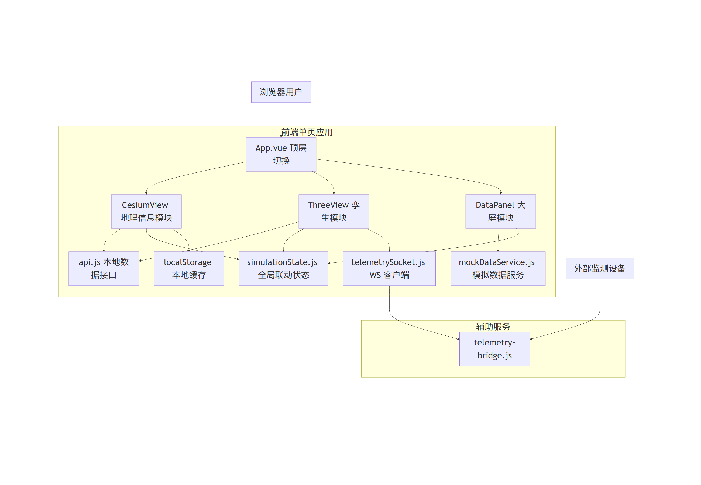
  <figcaption class="figure-caption">图 4-1 系统架构图</figcaption>
</figure>

该图从总体架构层面展示了本项目的组成方式。浏览器用户通过 `App.vue` 顶层切换进入三个前端子模块：Cesium 地理信息模块、Three.js 孪生模块和 DataPanel 大数据模块。前端内部同时依赖本地接口层 `api.js`、模拟数据服务 `mockDataService.js`、全局联动状态 `simulationState.js`、浏览器缓存和 WebSocket 客户端。后端辅助服务由 `telemetry-bridge.js` 组成，负责接收外部设备上报并向前端广播。该图清晰展示了“前端可视化系统 + 轻量桥接服务”的技术形态，适合放在总体设计章节，体现系统层次结构、模块边界和主要通信关系。

### 4.7 部署拓扑图

<figure class="doc-figure diagram-figure">
  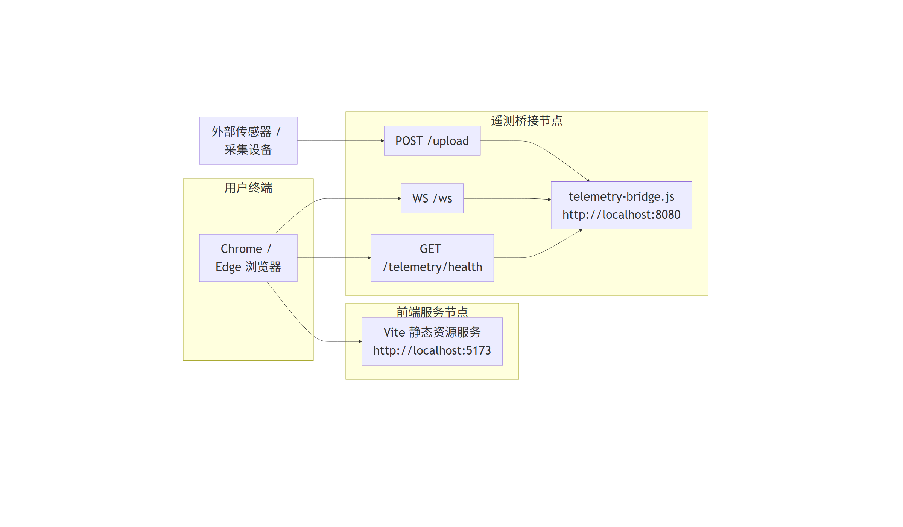
  <figcaption class="figure-caption">图 4-2 部署拓扑图</figcaption>
</figure>

该图描述系统在开发或演示环境下的基本部署拓扑。浏览器端通过 `http://localhost:5173` 访问 Vite 启动的前端服务，同时可通过 `ws://localhost:8080/ws` 或相关健康检查接口访问 Node.js 遥测桥接服务；外部传感器或采集设备则通过上传接口将 JSON 数据送入桥接服务。图中节点数量不多，但能够准确反映本项目当前采用的轻量部署模式，即前端静态资源服务与辅助遥测服务分离运行。该图适合用于运行环境和部署方式章节，帮助审阅人员理解系统在本地部署、联调和演示时的组成关系。

### 4.8 主要页面界面截图

<figure class="doc-figure screenshot-figure">
  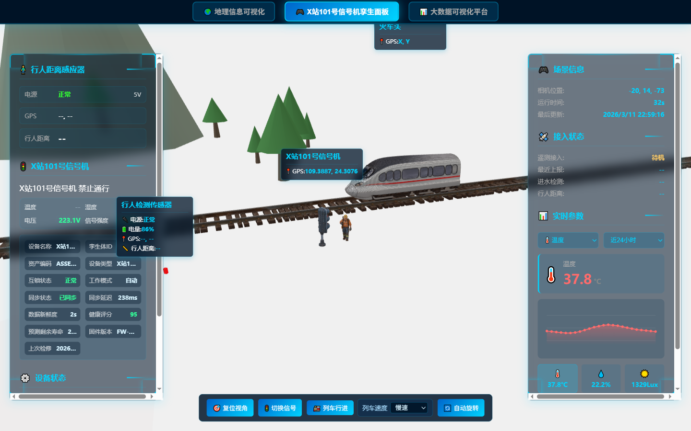
  <figcaption class="figure-caption">图 4-3 首页默认孪生面板截图</figcaption>
</figure>

该截图对应系统首页默认打开的数字孪生面板，入口为根地址首页。画面中展示了 X站101号信号机的三维孪生场景、轨道、山体、设备信息面板以及实时参数卡片，能够集中反映本系统“设备孪生 + 状态展示 + 操作控制”的核心特征。左侧区域重点体现行人距离感应器与信号机设备档案，中间区域体现 Three.js 三维建模场景和列车、轨道、人员对象，底部按钮体现复位视角、切换信号、列车行进和自动旋转等交互控制，右侧区域体现接入状态和实时参数曲线。该截图适合用作说明书中的首页界面展示，用于说明系统默认工作界面与核心业务对象。

<figure class="doc-figure screenshot-figure">
  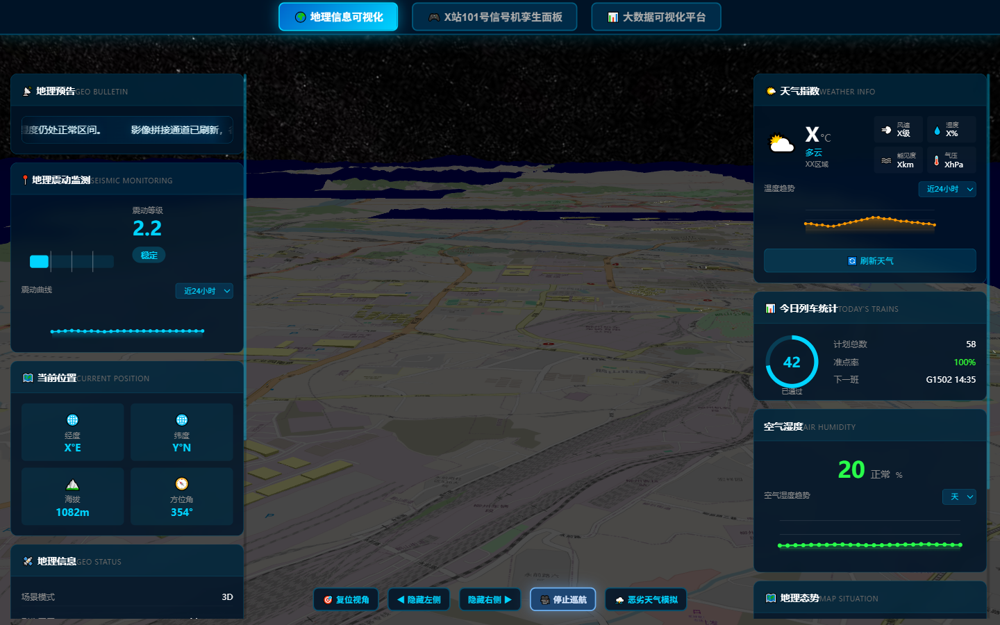
  <figcaption class="figure-caption">图 4-4 地理信息可视化页面截图</figcaption>
</figure>

该截图对应系统的地理信息可视化页面，入口为首页中的“地理信息可视化”页签。页面中心展示 Cesium 三维地球或线路地理场景，左右两侧则分布地理公告、震动监测、当前位置、天气指数、列车统计和地理态势等信息面板，体现系统对 GIS 可视化、地理态势分析和监测面板联动的综合能力。该页面不仅承担线路地理背景展示作用，还通过侧边统计面板将天气、震动、列车信息等内容整合到空间视图之中，使审阅人员可以直观看到系统如何把“地图、场景、监测、指标”统一在一个页面内。该截图适合在说明书的系统概述、总体设计和页面结构章节中使用。

<figure class="doc-figure screenshot-figure">
  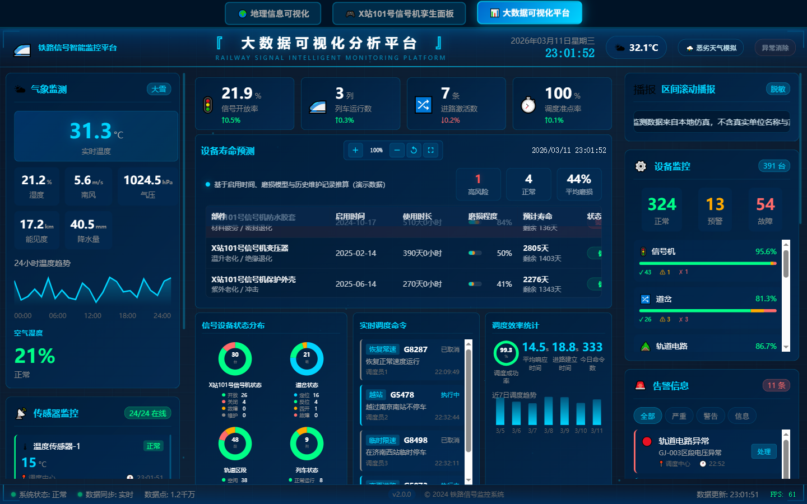
  <figcaption class="figure-caption">图 4-5 大数据可视化平台截图</figcaption>
</figure>

该截图对应大数据可视化平台页面，入口为首页中的“大数据可视化平台”页签。页面顶部展示系统标题、日期时间、天气状态和恶劣天气模拟按钮，中部和左右侧则集中展示气象监测、设备寿命预测、信号设备状态分布、实时调度命令、调度效率统计、设备监控、告警信息以及安全监控等内容。该页面的展示重点在于把多类业务指标以大屏形式整合到统一界面中，适合用于体现系统对综合态势分析、运维可视化和告警汇总展示的能力。截图中存在大量模块标题、数值卡片、图表和告警项，因此非常适合作为设计说明书中“综合展示页面”与“功能模块分区”的示例说明。

## 5 详细设计

### 5.1 地理信息可视化模块详细设计

该模块位于 `src/components/CesiumView.vue`，主要职责如下：

- 初始化 Cesium Viewer、配置地形和影像服务。
- 构建信标点位、波纹、位置信息和弹出交互。
- 提供相机飞行、巡航、角度控制和自动暂停功能。
- 提供气象、空气质量、地震趋势和铁路运行信息面板。
- 提供恶劣天气演练、背景音乐、AI 对话、缓存读写等辅助功能。

### 5.2 信号设备数字孪生模块详细设计

该模块位于 `src/components/ThreeView.vue`，主要职责如下：

- 初始化场景、相机、光照、地面、山体、轨道和列车模型。
- 创建信号灯、标签、环境装饰和天空粒子效果。
- 提供列车路径动画、信号灯切换、自动演示和相机控制。
- 管理参数曲线、视频监控列表、音频提醒和遥测状态显示。
- 根据遥测距离和涉水状态控制行人显示与高亮告警。

### 5.3 大数据可视化模块详细设计

该模块由 `src/components/DataPanel.vue` 及 `src/components/datapanel/` 子组件共同实现，主要职责如下：

- 顶层页面负责时间、天气总览、告警弹窗和全局异常流程控制。
- 左侧面板展示传感器状态、环境数据、AQI 与趋势信息。
- 中部面板展示区段态势、调度信息、寿命预测、缩略图和缩放拖拽交互。
- 右侧面板展示设备数量、告警列表、处理状态和滚动播报内容。

### 5.4 遥测桥接与数据服务设计

- `src/services/api.js` 提供前端本地模拟数据接口，统一异步返回格式。
- `src/composables/useApiData.js` 将数据接口封装为组合式函数，简化页面调用。
- `src/services/simulationState.js` 保存恶劣天气联动和湿度处置状态。
- `src/services/telemetrySocket.js` 实现自动重连、最新数据缓存和连接状态维护。
- `server/telemetry-bridge.js` 提供 HTTP 上传与 WebSocket 推送能力。

### 5.5 输入输出设计

输入主要包括：

- 页面点击、视图切换、缩放拖拽、告警处理等用户操作输入。
- 外部设备上传的 JSON 遥测数据。
- 环境变量输入，如 `VITE_TELEMETRY_WS_URL`、`VITE_STREAM_URL`。

输出主要包括：

- 地图、三维模型、大屏图表和告警弹窗等界面输出。
- 控制台日志、模拟日志记录和 WebSocket 消息广播。
- 浏览器本地缓存数据。

### 5.6 异常处理设计

- 遥测上传接口限制请求体大小，并对 JSON 解析异常返回错误结果。
- WebSocket 客户端在连接异常后自动重连。
- Cesium 初始化失败时保留面板展示，避免整页不可用。
- 视频流地址未配置时页面显示“未配置”，避免无效请求。

### 5.7 日志设计

- 服务端日志：遥测桥接服务输出上传开始、结束、错误、广播数量等日志。
- 前端日志：WebSocket 连接状态、视频加载状态、控制台告警信息。
- 模拟日志：`src/services/api.js` 提供内存日志数据结构用于展示与调试。

### 5.8 监测联动流程图

<figure class="doc-figure diagram-figure">
  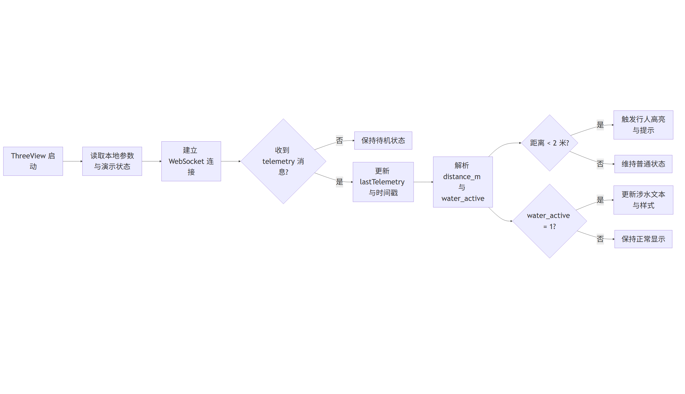
  <figcaption class="figure-caption">图 5-1 监测联动流程图</figcaption>
</figure>

该图聚焦于数字孪生页面内部的监测联动逻辑。ThreeView 组件启动后，首先读取本地参数和演示状态，然后建立 WebSocket 遥测连接；当没有收到遥测消息时，界面保持待机显示，一旦收到消息，则更新最近遥测数据和时间戳，并继续解析 `distance_m` 和 `water_active` 两类关键字段。之后根据距离阈值判断是否触发行人高亮与提示，根据涉水标志更新告警文字和样式。该图将页面级条件判断串联成完整流程，非常适合放入详细设计章节，用于解释前端界面的实时联动逻辑和状态流转机制。

### 5.9 遥测接入时序图

<figure class="doc-figure diagram-figure">
  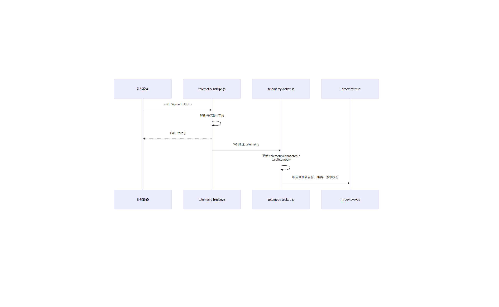
  <figcaption class="figure-caption">图 5-2 遥测接入时序图</figcaption>
</figure>

该时序图说明遥测接入过程中的参与对象和调用顺序。外部设备首先通过 `POST /upload` 向桥接服务发送 JSON 数据，桥接服务在内部完成字段解析、标准化处理和必要校验后，向设备返回成功响应；随后桥接服务再通过 WebSocket 向浏览器侧推送 telemetry 主题消息，浏览器端的 `telemetrySocket.js` 更新连接状态和最近一次遥测对象，最终由 `ThreeView.vue` 响应式刷新界面中的距离、涉水和告警显示。该图特别适合放在接口设计或详细设计章节，用于补充普通流程图难以表达的时序关系。

## 6 数据设计

### 6.1 数据对象设计

- 信号设备对象：`id`、`name`、`status`、`temperature`、`humidity`、`light_intensity`、`voltage`、`current`、`signal_strength`
- 列车统计对象：`passed_count`、`total_count`、`on_time_rate`、`next_train`
- 线路对象：`name`、`start_station`、`end_station`、`length_km`
- 遥测对象：`type`、`device`、`device_id`、`ts_ms`、`uptime_ms`、`wifi_ip`、`distance_cm`、`distance_m`、`water_active`、`raw`

### 6.2 数据库表设计

当前版本未使用持久化数据库，不存在正式数据库表结构。

### 6.3 字段说明

- 温湿度、电压、电流、光照和信号强度用于反映信号机运行环境与设备状态。
- `distance_m` 用于表示行人与设备之间的距离。
- `water_active` 用于表示涉水状态或盒体进水指示。

### 6.4 数据关系说明

- 遥测对象与数字孪生页面中的目标设备展示相关联。
- 全局恶劣天气状态与 Cesium 页面、大数据页面中的湿度与告警展示联动。
- 大屏各子组件通过父组件传参与共享状态实现关联。

### 6.5 初始化数据与脚本说明

- `src/services/api.js` 中 `memory` 对象提供信号设备、列车统计、线路、AI 对话和日志初始数据。
- `src/services/mockDataService.js` 动态构造时间序列、设备统计、寿命预测和告警数据。
- 数据库初始化脚本：待补充。

### 6.6 数据对象关系图

<figure class="doc-figure diagram-figure">
  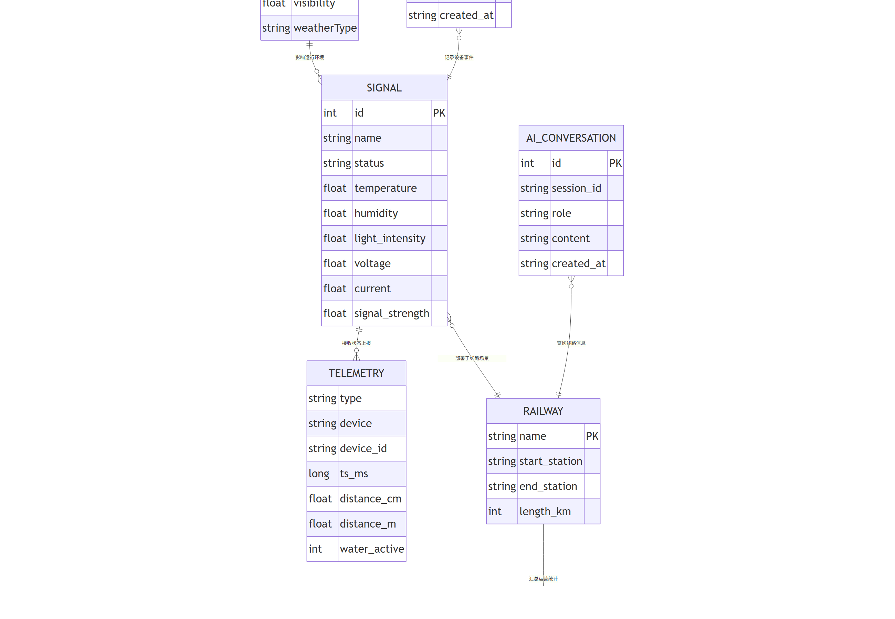
  <figcaption class="figure-caption">图 6-1 数据对象 E-R 图</figcaption>
</figure>

该图以 E-R 方式整理了当前项目中具有代表性的数据对象及其关系。虽然系统当前没有持久化数据库，但前端内存对象、遥测对象、天气对象、列车统计对象、线路对象、AI 对话对象和日志对象之间依然存在稳定的数据结构关系。图中展示了 `SIGNAL` 与 `TELEMETRY`、`RAILWAY`、`WEATHER`、`LOG_ENTRY` 的关联，以及 `RAILWAY` 与 `TRAIN_STATS`、`AI_CONVERSATION` 的联系。该图的价值在于帮助审阅人员理解系统中“对象是如何被组织和联动”的，而不是误认为项目完全缺少数据设计。

## 7 接口设计

### 7.1 内部接口

- 数据获取接口：`getSignals`、`getWeatherData`、`getAirQuality`、`getTrainStats`、`getRailway`、`getParamHistory`
- 对话与日志接口：`getAiConversations`、`addAiConversation`、`getLogs`、`addLog`
- 组合式接口：`useDashboardData`、`useWeatherData`、`useTrainStatsData` 等

### 7.2 外部接口

- `POST /upload`
- `GET /telemetry/health`
- `WS /ws`

### 7.3 参数说明

- `POST /upload` 支持 JSON 字段 `type`、`device`、`device_id`、`ts_ms`、`uptime_ms`、`wifi_ip`、`distance_cm`、`water_active` 等。
- `GET /telemetry/health` 无需业务参数。
- `WS /ws` 连接成功后可接收 `topic=telemetry` 的消息数据。

### 7.4 返回结果说明

- 上传成功返回 `{ ok: true }`。
- 上传失败返回 `{ ok: false, error, detail? }`。
- WebSocket 消息格式为 `{ topic: 'telemetry', data: { ... } }`。

### 7.5 接口安全说明

- 上传接口对请求体大小进行限制。
- 上传接口执行 JSON 解析校验。
- 当前版本未实现接口鉴权和签名校验，适用于演示或受控网络环境。

### 7.6 接口运行截图

<figure class="doc-figure screenshot-figure">
  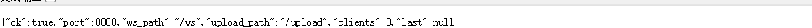
  <figcaption class="figure-caption">图 7-1 遥测桥接健康检查截图</figcaption>
</figure>

该截图对应遥测桥接服务的健康检查接口页面，入口通常为 `http://localhost:8080/telemetry/health`。页面虽然是 JSON 结果，但其展示内容直接反映了后端桥接服务的运行状态，包括服务是否可用、监听端口、WebSocket 路径、上传路径、当前连接客户端数以及最近一次遥测数据概要。相较于纯前端页面，这类接口截图能够从另一个角度证明系统并非完全静态展示，而是具备辅助服务、接口输出和状态反馈能力。将该截图纳入说明书，可以补充说明系统的服务化支撑能力、接口可用性和运行验证结果，在“接口设计”或“测试与验证说明”章节中具有较高材料价值。

## 8 运行环境设计

### 8.1 硬件环境

- 开发硬件环境：CPU Core i5-4570 3.2GHz、内存 16GB、硬盘 500G*2
- 运行硬件环境：CPU Core i5-4570 3.2GHz、内存 4GB、硬盘 100GB

### 8.2 软件环境

- Windows 10 64 位开发环境
- Node.js 18 及以上
- npm 9 及以上
- Chrome、Edge 等现代浏览器

### 8.3 运行依赖

- Vue 3
- Vite
- Cesium
- Three.js
- ws
- GSAP、ECharts 等前端可视化依赖

### 8.4 部署方式

- 前端通过 `npm run build` 构建静态资源。
- 前端开发环境通过 `npm run dev` 启动。
- 遥测桥接服务通过 `npm run telemetry` 启动。
- 若需要本地一体联调，可执行 `npm run dev:all`。

## 9 安全与权限设计

### 9.1 身份认证

当前版本未实现独立身份认证模块。

### 9.2 权限控制

当前版本未实现基于角色的权限控制，页面功能对本地使用者默认开放。

### 9.3 数据安全

- 通过请求体大小限制减少异常数据风险。
- 前端缓存仅用于展示数据恢复，不用于敏感数据保存。
- 正式生产环境的数据加密、访问控制与专网隔离措施：待补充。

### 9.4 操作审计

- 当前以控制台日志与前端模拟日志为主。
- 完整审计平台和操作留痕能力：待补充。

## 10 脚本与运维说明

### 10.1 启动脚本

- `npm run dev`：启动前端开发服务器。
- `npm run telemetry`：启动遥测桥接服务。
- `npm run dev:all`：并行启动前端和遥测服务。

### 10.2 部署脚本

- 当前仓库未提供独立自动化部署脚本，部署流程以 Vite 构建和 Node.js 启动命令为主。

### 10.3 数据初始化脚本

- 当前未提供数据库初始化脚本。
- 本地模拟数据由源码内存对象与 Mock 服务直接初始化。

### 10.4 定时任务与维护脚本

- 前端页面中通过定时器刷新数据、同步缓存和驱动演示动画。
- 专门的系统级定时任务脚本：待补充。

## 11 测试与验证说明

### 11.1 测试范围

- 页面构建与运行验证
- 三大主视图切换验证
- 遥测桥接接口验证
- 大屏告警与恶劣天气联动验证

### 11.2 测试方式

- 本地运行前端和遥测服务进行人工验证
- 通过构建命令验证前端工程可正常打包
- 通过 HTTP 请求和 WebSocket 连接验证桥接功能

### 11.3 主要验证内容

- 页面是否正常渲染
- 组件切换是否正常
- 遥测数据是否能够成功上传并推送
- 告警状态是否能随全局状态联动变化

## 12 总结

### 12.1 系统特点

- 同时具备 GIS 场景展示、三维数字孪生和大屏分析能力。
- 支持本地模拟数据与外部遥测数据混合展示。
- 支持恶劣天气、湿度异常、人员靠近等联动演示。

### 12.2 当前完成情况

- 已完成前端三大主视图、模拟数据服务、全局联动状态和遥测桥接服务。
- 已具备软著材料整理所需的主要代码、架构与功能说明基础。

### 12.3 后续可扩展方向

- 增加真实数据库与历史数据存储能力。
- 增加账号认证、角色权限和审计能力。
- 增加完整视频代理服务与更多外部设备接入方式。
- 增加自动化测试与正式部署脚本。

## 13 附录一：页面与菜单矩阵

表 13-1 页面与菜单矩阵

| 页面/视图 | 入口位置 | 主要内容 | 主要交互 |
| --- | --- | --- | --- |
| 地理信息可视化 | `src/App.vue` 顶层 Tab | Cesium 地图、地理态势、天气与地震面板、AI 对话 | 复位视角、巡航控制、恶劣天气模拟、面板显示切换 |
| 信号机孪生面板 | `src/App.vue` 顶层 Tab | Three.js 三维设备、列车动画、视频监控、参数曲线 | 切换信号、控制列车、视频重连、参数维度切换 |
| 大数据可视化平台 | `src/App.vue` 顶层 Tab | 环境监测、设备统计、告警信息、寿命预测、调度信息 | 恶劣天气模拟、异常消除、筛选告警、缩放寿命图 |
| 左侧环境面板 | `src/components/datapanel/LeftPanel.vue` | 气象监测、传感器列表、环境指标 | 趋势查看、传感器状态浏览 |
| 中部调度面板 | `src/components/datapanel/CenterPanel.vue` | 线路总览、寿命预测、调度命令、趋势统计 | 缩放拖拽、最小地图定位、全屏显示 |
| 右侧告警面板 | `src/components/datapanel/RightPanel.vue` | 设备监控、告警列表、安全监控、工单信息 | 告警筛选、处理状态查看 |

## 14 附录二：部署、环境变量与运行命令

### 14.1 环境变量清单

表 14-1 环境变量清单

| 变量名 | 作用 | 默认值/现状 | 使用位置 |
| --- | --- | --- | --- |
| `VITE_CESIUM_ION_TOKEN` | 配置 Cesium Ion Token | 未配置时回退到组件内置 token | `src/components/CesiumView.vue` |
| `VITE_TELEMETRY_WS_URL` | 配置浏览器端遥测 WebSocket 地址 | `ws://localhost:8080/ws` | `src/services/telemetrySocket.js` |
| `VITE_STREAM_URL` | 配置视频监控流地址 | 未配置时视频卡片显示“未配置” | `src/components/ThreeView.vue` |
| `TELEMETRY_PORT` | 配置遥测桥接服务监听端口 | `8080` | `server/telemetry-bridge.js` |
| `TELEMETRY_WS_PATH` | 配置 WebSocket 路径 | `/ws` | `server/telemetry-bridge.js` |
| `TELEMETRY_UPLOAD_PATH` | 配置上传路径 | `/upload` | `server/telemetry-bridge.js` |
| `TELEMETRY_MAX_BODY_BYTES` | 限制上传请求体大小 | `32768` | `server/telemetry-bridge.js` |

### 14.2 启动与构建命令清单

表 14-2 启动与构建命令清单

| 命令 | 说明 | 输出 |
| --- | --- | --- |
| `npm run dev` | 启动 Vite 前端开发服务器 | 本地单页应用页面 |
| `npm run telemetry` | 启动 Node.js 遥测桥接服务 | HTTP 上传接口与 WebSocket 服务 |
| `npm run dev:all` | 并行启动前端与遥测服务 | 适用于联调演示 |
| `npm run build` | 生成前端静态构建产物 | 用于部署的前端资源 |
| `npm run preview` | 预览构建结果 | 本地预览页面 |

## 15 附录三：主要源码文件职责矩阵

表 15-1 主要源码文件职责矩阵

| 文件 | 行数 | 职责说明 |
| --- | --- | --- |
| index.html | 14 | 前端单页应用挂载点与页面基础容器。 |
| vite.config.js | 18 | Vite 构建配置，集成 Vue 与 Cesium 插件。 |
| src/main.js | 5 | Vue 应用入口，挂载根组件。 |
| src/App.vue | 118 | 应用顶层布局与三类主视图切换入口。 |
| src/config/demoScenario.js | 23 | 演示场景名称、站点、告警文本等基础业务常量。 |
| src/services/api.js | 301 | 前端本地内存数据服务，提供信号设备、天气、地震、统计、对话、日志等接口。 |
| src/services/mockDataService.js | 775 | 大数据面板模拟数据生成器，负责设备、天气、趋势、寿命和告警数据构造。 |
| src/services/simulationState.js | 114 | 跨页面共享的恶劣天气、湿度告警和处置状态同步模块。 |
| src/services/telemetrySocket.js | 115 | 浏览器端 WebSocket 遥测连接、重连与最新数据缓存模块。 |
| src/composables/useApiData.js | 239 | 组合式 API 数据调用封装，统一 loading、error 与数据状态。 |
| src/components/CesiumView.vue | 2823 | Cesium 地理信息可视化主界面，含地图、巡航、气象、面板、AI 对话和缓存逻辑。 |
| src/components/ThreeView.vue | 3271 | Three.js 数字孪生主界面，含信号机模型、列车动画、视频监控和遥测联动。 |
| src/components/DataPanel.vue | 1042 | 大数据可视化总控页面，负责顶部信息、全局告警和左右中子面板联动。 |
| src/components/datapanel/LeftPanel.vue | 726 | 左侧环境与传感器状态面板。 |
| src/components/datapanel/CenterPanel.vue | 1631 | 中部调度总览、寿命预测和线路态势面板。 |
| src/components/datapanel/RightPanel.vue | 963 | 右侧设备统计、告警列表和运维概览面板。 |
| src/js/cesium.js | 544 | 早期 Cesium 独立脚本版本，保留地图能力演进参考。 |
| src/js/threejs.js | 726 | 早期 Three.js 独立脚本版本，保留三维孪生能力演进参考。 |
| server/telemetry-bridge.js | 189 | Node.js 遥测桥接服务，提供 HTTP 接收与 WebSocket 广播。 |
| package.json | 42 | 项目依赖与开发命令配置。 |

## 16 附录四：核心函数目录

### src/components/CesiumView.vue

src/components/CesiumView.vue 函数目录表

| 序号 | 函数/方法名 |
| --- | --- |
| 1 | readCesiumCache |
| 2 | writeCesiumCache |
| 3 | restoreCesiumCache |
| 4 | onSeismicTimeChange |
| 5 | byRange |
| 6 | onWeatherTimeChange |
| 7 | syncWeatherFromMock |
| 8 | refreshWeather |
| 9 | parsePercent |
| 10 | clamp |
| 11 | hexToRgb |
| 12 | rgbToHex |
| 13 | to2 |
| 14 | lerp |
| 15 | lerpColor |
| 16 | onAirQualityTimeChange |
| 17 | sendAiMessage |
| 18 | quickAsk |
| 19 | scrollToBottom |
| 20 | toggleLeftPanel |
| 21 | toggleRightPanel |
| 22 | startRainFogSimulation |
| 23 | stopRainFogSimulation |
| 24 | startBackgroundMusic |
| 25 | stopBackgroundMusic |
| 26 | installAudioUnlockFallback |
| 27 | toggleSevereWeather |
| 28 | stopSevereWeatherUiEffects |
| 29 | applySevereWeatherChange |
| 30 | normalizeDeg360 |
| 31 | lerpAngleDeg |
| 32 | smoothstep |
| 33 | sampleCruiseOrientation |
| 34 | clampCruisePitchDeg |
| 35 | cruiseTargetWithEnuOffset |
| 36 | stopCameraCruise |
| 37 | startCameraCruise |
| 38 | tick |
| 39 | toggleCameraCruise |
| 40 | installCameraCruiseAutoPause |
| 41 | onMove |
| 42 | cleanup |
| 43 | setupGlobalBreathingGlow |
| 44 | initCesium |
| 45 | addBaseLayers |
| 46 | switchToOsm |
| 47 | installImageryErrorFallback |
| 48 | installCameraAngleLogger |
| 49 | flyToLiuZhou |
| 50 | resetView |
| 51 | hidePopup |
| 52 | setupInteractions |
| 53 | updatePositionDisplay |
| 54 | updatePopupPositions |
| 55 | createBeaconPoints |
| 56 | updateWaveAnimation |
| 57 | updateData |
| 58 | loadDashboardData |
| 59 | loadSeismicData |
| 60 | loadWeatherHistory |

### src/components/ThreeView.vue

src/components/ThreeView.vue 函数目录表

| 序号 | 函数/方法名 |
| --- | --- |
| 1 | getWorldYaw |
| 2 | setPedestrianVisible |
| 3 | triggerPedestrianHotFlash |
| 4 | applyTwinEnvVisibilityToLabels |
| 5 | onGlobalKeydown |
| 6 | updateTelemetrySim |
| 7 | stopFrontendTelemetrySim |
| 8 | startFrontendTelemetrySim |
| 9 | scheduleNextPass |
| 10 | runPass |
| 11 | jitterDistance |
| 12 | onParamChange |
| 13 | onParamTimeChange |
| 14 | STREAM_URL |
| 15 | logVideo |
| 16 | buildStreamUrl |
| 17 | loadVideo |
| 18 | onVideoLoad |
| 19 | reloadVideo |
| 20 | playPedestrianNotice |
| 21 | ensureGltfLoader |
| 22 | getCachedModelClone |
| 23 | createRadialGlowTexture |
| 24 | createSkyParticles |
| 25 | createRailEndpointGlows |
| 26 | makeGlow |
| 27 | getClosestPathProgress |
| 28 | getColorByState |
| 29 | init |
| 30 | setupLights |
| 31 | createAxisHelper |
| 32 | createAxisLabel |
| 33 | createGround |
| 34 | createMountains |
| 35 | createRailway |
| 36 | createSignalLights |
| 37 | getObjectSize |
| 38 | placeOnGround |
| 39 | createBoxSensorLabel |
| 40 | createSensorWave |
| 41 | loadAndPlaceNear |
| 42 | createTrain |
| 43 | createModelLabel |
| 44 | updateLabelFields |
| 45 | toTrainGps |
| 46 | getPedestrianDistanceMeters |
| 47 | updateHumanoidSensorPanel |
| 48 | updateBoxSensorLabel |
| 49 | startAutoDemo |
| 50 | createTrees |
| 51 | updateSignalUI |
| 52 | toggleSignals |
| 53 | trainAnimation |
| 54 | toggleRotation |
| 55 | resetView |
| 56 | onWindowResize |
| 57 | updateUI |
| 58 | updateSignalParams |
| 59 | loadParamHistory |
| 60 | animate |

### src/components/DataPanel.vue

src/components/DataPanel.vue 函数目录表

| 序号 | 函数/方法名 |
| --- | --- |
| 1 | ensureAlarmAudio |
| 2 | playAlarmOnce |
| 3 | maybePlayAlarmOnEnterOrShow |
| 4 | formatNumber |
| 5 | particleStyle |
| 6 | updateTime |
| 7 | updateData |
| 8 | toggleSevereWeather |
| 9 | clearHumidityAnomaly |
| 10 | dismissHumidityAlert |
| 11 | markHumidityAlertProcessing |
| 12 | dismissHumidityObservation |

### src/components/datapanel/LeftPanel.vue

src/components/datapanel/LeftPanel.vue 函数目录表

| 序号 | 函数/方法名 |
| --- | --- |
| 1 | trendPointY |
| 2 | sensorIcon |
| 3 | statusText |
| 4 | sensorHistoryPoints |
| 5 | random |

### src/components/datapanel/CenterPanel.vue

src/components/datapanel/CenterPanel.vue 函数目录表

| 序号 | 函数/方法名 |
| --- | --- |
| 1 | stopLifeAutoScroll |
| 2 | pauseLifeAutoScroll |
| 3 | resumeLifeAutoScroll |
| 4 | startLifeAutoScroll |
| 5 | step |
| 6 | toYmd |
| 7 | formatDuration |
| 8 | clamp |
| 9 | updateLifeRows |
| 10 | rank |
| 11 | zoomIn |
| 12 | zoomOut |
| 13 | resetZoom |
| 14 | handleWheel |
| 15 | startDrag |
| 16 | onDrag |
| 17 | endDrag |
| 18 | startMinimapDrag |
| 19 | updatePanFromMinimap |
| 20 | toggleFullscreen |
| 21 | createPieData |
| 22 | getSectionColor |
| 23 | getTrainStatusColor |
| 24 | showSignalInfo |
| 25 | updateTime |
| 26 | handleMinimapMove |

### src/components/datapanel/RightPanel.vue

src/components/datapanel/RightPanel.vue 函数目录表

| 序号 | 函数/方法名 |
| --- | --- |
| 1 | equipmentIcon |
| 2 | formatTime |

### src/services/api.js

src/services/api.js 函数目录表

| 序号 | 函数/方法名 |
| --- | --- |
| 1 | nowIso |
| 2 | wait |
| 3 | randomFloat |
| 4 | generateSeries |
| 5 | getSeriesLength |
| 6 | getSignals |
| 7 | getSignal |
| 8 | createSignal |
| 9 | updateSignal |
| 10 | deleteSignal |
| 11 | getSeismicData |
| 12 | addSeismicData |
| 13 | getWeatherData |
| 14 | getCurrentWeather |
| 15 | getAirQuality |
| 16 | getTrainStats |
| 17 | updateTrainStats |
| 18 | getRailway |
| 19 | getParamHistory |
| 20 | getAiConversations |
| 21 | addAiConversation |
| 22 | getLogs |
| 23 | addLog |
| 24 | getDashboard |

### src/services/mockDataService.js

src/services/mockDataService.js 函数目录表

| 序号 | 函数/方法名 |
| --- | --- |
| 1 | random |
| 2 | mulberry32 |
| 3 | randomChoice |
| 4 | generateTimeSeries |
| 5 | risingSeries |
| 6 | clamp |
| 7 | buildHumidityTrend |
| 8 | getWeatherData |
| 9 | easeOutQuad |
| 10 | lerp |
| 11 | humidityAtTime |
| 12 | getSensorData |
| 13 | getEquipmentData |
| 14 | getAlarmData |
| 15 | getTrainData |
| 16 | getEnergyData |
| 17 | getSystemStatus |
| 18 | getSecurityData |
| 19 | getWorkOrderData |
| 20 | getOverviewData |
| 21 | getMapHotspots |
| 22 | getSignalDispatchData |
| 23 | getSignalDistribution |
| 24 | getDispatchEfficiency |
| 25 | subscribeToRealtimeData |

### src/services/simulationState.js

src/services/simulationState.js 函数目录表

| 序号 | 函数/方法名 |
| --- | --- |
| 1 | clamp |
| 2 | easeOutQuad |
| 3 | lerp |
| 4 | humidityAtTime |
| 5 | tickSyncedHumidity |
| 6 | startHumiditySync |
| 7 | stopHumiditySync |
| 8 | markHumidityMitigationApplied |
| 9 | resetHumidityMitigation |
| 10 | setHumidityAlertDismissed |
| 11 | setHumidityAlertSuppressed |
| 12 | setHumidityAlertProcessing |
| 13 | setSevereWeatherEnabled |

### src/services/telemetrySocket.js

src/services/telemetrySocket.js 函数目录表

| 序号 | 函数/方法名 |
| --- | --- |
| 1 | defaultUrl |
| 2 | scheduleReconnect |
| 3 | connectTelemetry |
| 4 | disconnectTelemetry |

### src/composables/useApiData.js

src/composables/useApiData.js 函数目录表

| 序号 | 函数/方法名 |
| --- | --- |
| 1 | useDashboardData |
| 2 | fetchData |
| 3 | useSignalsData |
| 4 | fetchSignals |
| 5 | useSeismicData |
| 6 | fetchSeismic |
| 7 | useWeatherData |
| 8 | fetchWeather |
| 9 | fetchCurrentWeather |
| 10 | useAirQualityData |
| 11 | fetchAirQuality |
| 12 | useTrainStatsData |
| 13 | fetchTrainStats |
| 14 | useRailwayData |
| 15 | fetchRailway |
| 16 | useParamsHistory |
| 17 | fetchParamHistory |
| 18 | useAiConversations |
| 19 | fetchConversations |
| 20 | addConversation |

### server/telemetry-bridge.js

server/telemetry-bridge.js 函数目录表

| 序号 | 函数/方法名 |
| --- | --- |
| 1 | now |
| 2 | log |
| 3 | writeCommonHeaders |
| 4 | safeJsonParse |
| 5 | normalizeTelemetry |
| 6 | broadcastTelemetry |

## 17 附录五：主要响应式状态目录

### src/components/CesiumView.vue

src/components/CesiumView.vue 响应式变量目录表

| 序号 | 响应式变量 |
| --- | --- |
| 1 | cesiumContainer |
| 2 | leftPanelVisible |
| 3 | rightPanelVisible |
| 4 | networkOnline |
| 5 | airQualitySevereWarning |
| 6 | cameraCruiseEnabled |
| 7 | seismicLevel |
| 8 | seismicTimeRange |
| 9 | hoveredSeismicPoint |
| 10 | seismicData24h |
| 11 | seismicDataWeek |
| 12 | seismicDataMonth |
| 13 | currentSeismicData |
| 14 | seismicTimeLabels |
| 15 | seismicChartPoints |
| 16 | seismicLinePoints |
| 17 | seismicAreaPoints |
| 18 | seismicColor |
| 19 | seismicStatus |
| 20 | seismicStatusClass |
| 21 | currentPosition |
| 22 | geoStats |
| 23 | geoTickerItemsLoop |
| 24 | currentRailway |
| 25 | trainStats |
| 26 | weather |
| 27 | weatherLoading |
| 28 | weatherTimeRange |
| 29 | hoveredWeatherPoint |
| 30 | maskedWeather |
| 31 | weatherCompactItems |
| 32 | weatherData24h |
| 33 | weatherDataWeek |
| 34 | weatherDataMonth |
| 35 | humidityData24h |
| 36 | humidityDataWeek |
| 37 | humidityDataMonth |
| 38 | weatherTrendMode |
| 39 | weatherTrendTitle |
| 40 | weatherTrendUnit |
| 41 | weatherTrendColor |
| 42 | currentWeatherData |
| 43 | weatherTimeLabels |
| 44 | weatherChartPoints |
| 45 | weatherLinePoints |
| 46 | weatherAreaPoints |
| 47 | airQuality |
| 48 | airHumidity |
| 49 | airHumidityLevel |
| 50 | humidityClass |
| 51 | airQualityTimeRange |
| 52 | hoveredAirQualityPoint |
| 53 | currentAirQualityData |
| 54 | airQualityTimeLabels |
| 55 | airQualityColor |
| 56 | airQualityChartPoints |
| 57 | airQualityLinePoints |
| 58 | airQualityAreaPoints |
| 59 | aiMessages |
| 60 | aiInput |
| 61 | aiThinking |
| 62 | aiMessagesRef |

### src/components/ThreeView.vue

src/components/ThreeView.vue 响应式变量目录表

| 序号 | 响应式变量 |
| --- | --- |
| 1 | threeContainer |
| 2 | uiNowMs |
| 3 | signalParams |
| 4 | humidityClass |
| 5 | signalTwin |
| 6 | telemetryDistanceM |
| 7 | telemetryWaterActive |
| 8 | pedestrianDesiredVisible |
| 9 | pedestrianHotFlash |
| 10 | telemetrySimEnabled |
| 11 | telemetrySimLastAt |
| 12 | telemetryActive |
| 13 | twinEnvVisible |
| 14 | telemetryStatusText |
| 15 | telemetryStatusClass |
| 16 | telemetryLastSeenText |
| 17 | telemetryWaterText |
| 18 | telemetryWaterClass |
| 19 | selectedParam |
| 20 | paramTimeRange |
| 21 | hoveredParamPoint |
| 22 | paramConfig |
| 23 | currentParamValue |
| 24 | paramData1h |
| 25 | paramData24h |
| 26 | paramDataWeek |
| 27 | currentParamData |
| 28 | paramTimeLabels |
| 29 | paramChartPoints |
| 30 | paramLinePoints |
| 31 | paramAreaPoints |
| 32 | videoList |
| 33 | tempPercent |
| 34 | lightPercent |
| 35 | voltagePercent |
| 36 | currentPercent |
| 37 | signalPercent |
| 38 | tempClass |
| 39 | voltageClass |
| 40 | trainSpeed |
| 41 | humanoidSensor |
| 42 | boxSensor |

### src/components/DataPanel.vue

src/components/DataPanel.vue 响应式变量目录表

| 序号 | 响应式变量 |
| --- | --- |
| 1 | currentDate |
| 2 | currentTime |
| 3 | weather |
| 4 | overview |
| 5 | lastUpdate |
| 6 | fps |
| 7 | dataPoints |
| 8 | humidityAnomaly |
| 9 | showHumidityAlert |
| 10 | showHumidityObservation |
| 11 | heroDeviceName |
| 12 | currentHumidityText |
| 13 | humidityStage |
| 14 | humidityAlertClass |
| 15 | humidityAlertChartPoints |
| 16 | humidityAlertLinePoints |
| 17 | humidityAlertAreaPoints |
| 18 | humidityAlertLabelPoints |

### src/components/datapanel/LeftPanel.vue

src/components/datapanel/LeftPanel.vue 响应式变量目录表

| 序号 | 响应式变量 |
| --- | --- |
| 1 | weather |
| 2 | sensors |
| 3 | updateTimer |
| 4 | processedSensors |
| 5 | onlineSensors |
| 6 | displayedSensors |
| 7 | trendMode |
| 8 | trendTitle |
| 9 | trendColor |
| 10 | trendData |
| 11 | trendLinePath |
| 12 | trendAreaPath |
| 13 | trendPoints |
| 14 | humidityShown |
| 15 | aqiColor |
| 16 | aqiLabel |
| 17 | envData |

### src/components/datapanel/CenterPanel.vue

src/components/datapanel/CenterPanel.vue 响应式变量目录表

| 序号 | 响应式变量 |
| --- | --- |
| 1 | dispatchData |
| 2 | signalDist |
| 3 | efficiency |
| 4 | currentTime |
| 5 | updateTimer |
| 6 | lifeTimer |
| 7 | lifeScrollRef |
| 8 | lifeRowsLoop |
| 9 | lifeBase |
| 10 | lifeRows |
| 11 | lifeSummary |
| 12 | dispatchContainer |
| 13 | canvasWrapper |
| 14 | dispatchSvg |
| 15 | zoomLevel |
| 16 | panX |
| 17 | panY |
| 18 | isDragging |
| 19 | dragStart |
| 20 | isMinimapDragging |
| 21 | canvasStyle |
| 22 | viewportWidth |
| 23 | viewportHeight |
| 24 | viewportX |
| 25 | viewportY |
| 26 | keyMetrics |
| 27 | displayLines |
| 28 | displaySections |
| 29 | displaySignals |
| 30 | displaySwitches |
| 31 | displayTrains |
| 32 | activeRoutes |
| 33 | dispatchStats |
| 34 | dispatchCommands |
| 35 | pieData |

### src/components/datapanel/RightPanel.vue

src/components/datapanel/RightPanel.vue 响应式变量目录表

| 序号 | 响应式变量 |
| --- | --- |
| 1 | equipment |
| 2 | alarms |
| 3 | security |
| 4 | workOrders |
| 5 | activeAlarmTab |
| 6 | updateTimer |
| 7 | tickerItemsLoop |
| 8 | totalDevices |
| 9 | normalDevices |
| 10 | warningDevices |
| 11 | errorDevices |
| 12 | alarmCount |
| 13 | filteredAlarms |
| 14 | securityColor |
| 15 | pieSlices |

### src/services/telemetrySocket.js

src/services/telemetrySocket.js 响应式变量目录表

| 序号 | 响应式变量 |
| --- | --- |

### src/services/simulationState.js

src/services/simulationState.js 响应式变量目录表

| 序号 | 响应式变量 |
| --- | --- |

## 18 附录六：图形与截图材料索引

表 18-1 图形与截图材料索引表

| 序号 | 图号 | 名称 | 文件路径 | 所属章节 |
| --- | --- | --- | --- | --- |
| 1 | 图 3-1 | 系统用例图 | docs/assets/diagrams/01-use-case.png | 系统概述 |
| 2 | 图 3-2 | 总体业务流程图 | docs/assets/diagrams/02-business-flow.png | 系统概述 |
| 3 | 图 4-1 | 系统架构图 | docs/assets/diagrams/03-system-architecture.png | 总体设计 |
| 4 | 图 4-2 | 部署拓扑图 | docs/assets/diagrams/04-deployment-topology.png | 总体设计 |
| 5 | 图 4-3 | 首页默认孪生面板截图 | docs/assets/screenshots/01-home-twin.png | 界面设计 |
| 6 | 图 4-4 | 地理信息可视化页面截图 | docs/assets/screenshots/02-gis-tab.png | 界面设计 |
| 7 | 图 4-5 | 大数据可视化平台截图 | docs/assets/screenshots/03-data-tab.png | 界面设计 |
| 8 | 图 5-1 | 监测联动流程图 | docs/assets/diagrams/05-telemetry-flow.png | 详细设计 |
| 9 | 图 5-2 | 遥测接入时序图 | docs/assets/diagrams/06-telemetry-sequence.png | 详细设计 |
| 10 | 图 6-1 | 数据对象 E-R 图 | docs/assets/diagrams/08-entity-relationship.png | 数据设计 |
| 11 | 图 7-1 | 遥测桥接健康检查截图 | docs/assets/screenshots/04-telemetry-health.png | 接口设计 |

本附录用于对设计说明书中使用的系统图、流程图、部署图、E-R 图以及界面截图进行集中索引说明，便于在材料核查、PDF 抽检和后续重新导出时快速定位对应的原始文件。表中按图号给出文件路径与所属章节，能够直接对应到设计说明书正文中的图题、图注与说明文字，确保图文关系一致、章节引用一致、归档文件一致。

从材料组织方式看，系统结构类图形统一放置在 `docs/assets/diagrams` 目录下，界面运行结果截图统一放置在 `docs/assets/screenshots` 目录下。这样处理的目的，是在清理临时目录后仍然可以保证 Markdown 源文件与最终 PDF 指向稳定的正式资产路径，不依赖临时缓存或中间生成目录，也不会因为后续清理动作导致文档内图片丢失或失效。

从复核方式看，审阅人员可先根据本附录核对图号、名称和章节，再逐项检查正文中的图题位置、图像清晰度和说明文字完整性。对于系统图，应重点核对结构关系、箭头方向与节点名称是否与正文描述一致；对于界面截图，应重点核对截图内容是否真实对应当前项目运行结果、文字是否清晰可辨、是否存在过度拉伸或缩放失真。本附录同时为后续更新 Skill 流程提供了明确的资产清单基础。

文档整理日期：2026/3/12
